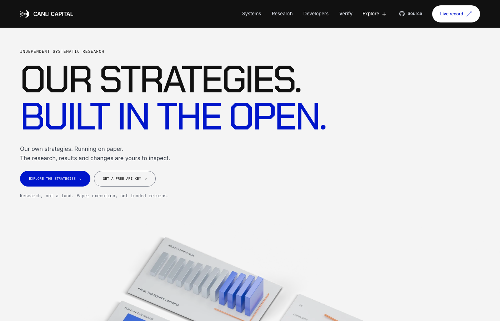
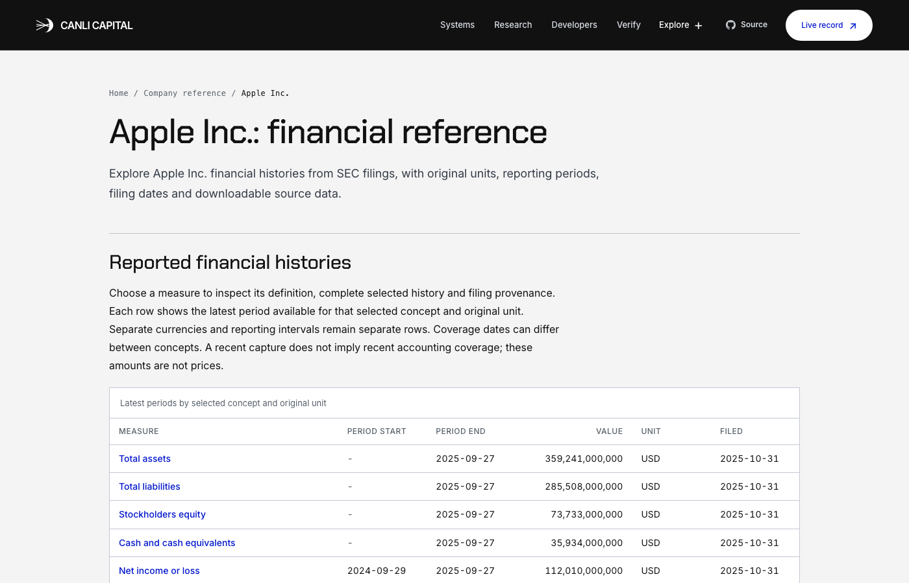

# Canli Capital

**Open quant research where every published number comes with the file that produced it, including
the strategies that failed.** Live at **[canlicapital.com](https://canlicapital.com)**.

[](https://www.npmjs.com/package/canli-validation-mcp)
[](https://glama.ai/mcp/servers/arhancanli/canli-validation-mcp)
[](https://scorecard.dev/viewer/?uri=github.com/arhancanli/canlicapital)
[](LICENSE)
[](LICENSE-DATA.md)



## Try it in a minute

```bash
# Ask your AI assistant whether a backtest is real (Claude Code shown; Cursor, VS Code and
# Claude Desktop setups are in mcp/README.md)
claude mcp add canli -- npx -y canli-validation-mcp

# Or call the free API: get a key, then deflate a Sharpe ratio for the number of trials you ran
curl -X POST https://canlicapital.com/api/v1/keys -H "Content-Type: application/json" -d '{"label":"readme"}'

# Or check the published record yourself (Python 3)
pip install cryptography
curl -sO https://canlicapital.com/glassbox/reproduce.py
for f in capacity_commitment founder_commitment; do curl -sO https://canlicapital.com/glassbox/$f.json; done
python3 reproduce.py --dir .
```

## What is here

- **Backtest validators** (deflated Sharpe, CSCV overfitting probability, minimum track record,
  haircut Sharpe, luck-equivalent trials) as an [MCP server](mcp/README.md) and a
  [free API](https://canlicapital.com/developers), each result with a signed receipt anyone can
  recompute.
- **Company reference pages** built from SEC XBRL filings: financial histories where every value
  links to the filing it came from, with the year-on-year change and growth rate worked out.

  
- **Research**, including what failed: the [kill log](https://canlicapital.com/open), the
  [Null Zoo](https://canlicapital.com/research/null-zoo-v0) (overfitting corrections scored where
  the truth is known) and [luck-equivalent trials](https://canlicapital.com/research/luck-equivalent-trials).
- **Open data**: [FilingFacts](https://canlicapital.com/research/filing-facts-v0), financial
  questions with machine-checked answers from SEC filings (CC BY 4.0).
- **ALPHAC**, the three-strategy paper-trading book whose record is published daily; its engine is
  **[github.com/arhancanli/alphac](https://github.com/arhancanli/alphac)**.

Help check it: [open review tasks](https://github.com/arhancanli/canlicapital/issues?q=is%3Aissue+is%3Aopen+label%3A%22review+task%22)
take 15 to 60 minutes and are credited on [/review](https://canlicapital.com/review). To build
with it, see [CONTRIBUTING.md](CONTRIBUTING.md). If the project is useful to you, a star helps
other people find it.

**Created and maintained by [Arhan Canli](https://github.com/arhancanli) for Canli Capital.**
Machine-readable software citation metadata is provided in [`CITATION.cff`](CITATION.cff).

Current work and verified limitations: [persistent goal status](docs/goal/STATUS.md).

## Why this repo is public

The site's whole claim is *"a quant fund proving itself in public before it asks you to trust
it."* — the tagline in `config/brand.js`. A site that makes that claim and hides its own source
is asking for a trust it hasn't earned. So: this is the source, including the parts that enforce
honesty on us.

The load-bearing one is **`docs/retracted_claims.txt` in the engine repo**. When a number is
withdrawn it goes on a blocklist, and `check_retracted_claims.py` scans `dist/` and `public/` for
it before each deploy. It cannot be satisfied by deleting the number — a retracted figure must
still be quotable *inside its own retraction*, so a match counts only when the explanation is
absent from the surrounding window.

That check exists because the retraction here had already failed twice: a withdrawn DSR of 0.83
stayed on the homepage and in the social-unfurl card for six days after the signed chain formally
withdrew it. The pipeline was publishing the correction and the error in the same run.

The gate is now fail-closed for publication. Since 2026-08-19, both `live_tick.sh` and
`live_publish.sh` run `check_retracted_claims.py` after regeneration and skip the deploy when it
fails. Trading remains outside that blast radius: a publication defect can stop the website from
shipping, but cannot place, cancel, or delay an order.

## Publication surfaces

| surface | what it is |
|---|---|
| `index.html` | the landing: thesis, systems teaser, live record |
| `systems.html` | how the strategies work |
| `research.html` | the research programme, literature reviews, feasibility protocols |
| `performance.html` | the methodology and the honest numbers |
| `progress.html` | the build log |
| `open.html` | proven in the open: the kill log, the signed chain, glass-box artifacts |
| `verify.html` | independent verification instructions and downloadable evidence |
| `review.html` | the governed public criticism bench for five flagship papers |
| `foundry.html` | the fail-closed design and deployment-acceptance status for Foundry |
| `founder.html` | the ProfilePage that resolves every Arhan Canli authorship claim |
| `methodology.html` | evidence-linked answers to the research methodology questions |
| `research/*.html` | 114 generated technical reports, each with Scholar metadata and BibTeX |
| `research/topics/*.html` | 13 substantive subject and research-stage indexes |
| `measurements/*.html` | 89 generated Dataset pages with explicit claim boundaries |
| `engineering.html` | the open-source hub: the three repositories, what is hard in them, and a reading path |
| `notes/*.html` | engineering notes: post-mortems, derivations and design arguments |
| `tools/selection-risk.html` | the Selection Risk Lab: search a series with no edge, watch the deflation kill what you find |
| `tools/breadth.html` | the Breadth Lab: what a book of N sleeves is worth, and the ceiling no amount of breadth can pass |
| `tools/execution.html` | the Execution Reality Lab: which execution assumptions are costs, and which only look like costs |
| `tools/backtest-overfitting.html` | probability of backtest overfitting by Combinatorially Symmetric Cross-Validation, run in the browser on your own matrix |
| `tools.html` | the index of every browser calculator this project publishes |
| `developers.html` | the public read API: endpoints, the response envelope, and what each response cannot be used to claim |
| `costs.html` | every cost that can reach a return, whether the engine charges it, and which way the answer is wrong when it does not |
| `standards/paper-evidence.html` | canli.paper-evidence.v0, a proposed open standard whose required fields are the ones a performance claim usually omits |

`public/paper-state.json` and `public/glassbox/*` are written by the engine's publish job, not by
hand. They are the machine-readable form of every claim the pages make. Current corpus counts are
derived during the build from `public/research-index.json`,
`public/glassbox/trial_packet_manifest.json`, and the generated measurement directory; the sitemap
is generated from the same files rather than maintained separately. The present build contains
331 canonical URLs in the sitemap (all indexable), plus a public noindex evidence page for every incomplete registered
trial and one archival HTML paper per registered sleeve. It publishes
identity-level packets for all 228 recorded hypotheses, while
honestly marking 226 of those packets incomplete.

## Build and run

```sh
npm install
npm run build      # Vite multi-page build -> dist/
npm run preview    # serve the built dist
npm run dev        # dev server with hot reload
```

Three.js, GSAP + ScrollTrigger and Lenis are self-hosted — they install from npm and Vite
fingerprints them into `dist`. **Nothing is fetched from a CDN at runtime.** The build must stay
green, and source plus `dist` must contain zero em dashes (U+2014); both are audited before deploy.

## Brand and facts are single-sourced

`config/brand.js` is the one place names and numbers live. `js/shell.js` renders the nav and footer
from it so every page ships byte-identical chrome, and `js/main.js` binds `data-brand`,
`data-flagship`, `data-tagline` and `data-fact` nodes from it.

**`STATS` and `FACTS` are the only numeric claims permitted on the hand-authored marketing
surfaces.** Generated papers and measurement pages obtain their figures from engine exports and
carry their own source paths and claim boundaries. `audit-published-numbers.mjs` reconciles the
shared site-level figures; do not add a number to either layer without binding it to an
authoritative artifact.

## Not investment advice

Nothing on this site or in this repo is investment advice, an offer, or a solicitation. The record
published here is **paper trading**; the published ALPHAC strategy record includes no funded performance. Simulated and past
performance do not indicate future results. See `LICENSE`: provided "as is", without warranty.

## Glass-box platform expansion

The [platform direction and quality contract](docs/GLASSBOX-PLATFORM-VISION-2026-09-19.md)
connect the research engine, developer API/MCP and the company-reference collection. The local
expansion candidate adds 49 SEC-backed reference pages; it is not a million-page deployment.
The search goal is **at least 800,000 indexed pages, targeting 1,000,000**, recorded in
`config/search-growth-goal.json`. `npm run seo:inventory` reports built counts separately from
actual indexing evidence; the indexed count remains unverified until Search Console evidence
is available. `--require-indexed-minimum` fails while that evidence is missing.
`npm run seo:capacity` tests sitemap transport with synthetic URLs in a temporary directory.

Refresh selected company records explicitly with `npm run companies:import -- CIK [CIK ...]`.
Builds use captured public JSON and original compressed source snapshots, with no network ingestion
during publication. The selected latest-filed histories may contain restatements and are not
point-in-time backtest data. Public JSON downloads do not extend the validation API's capabilities.
