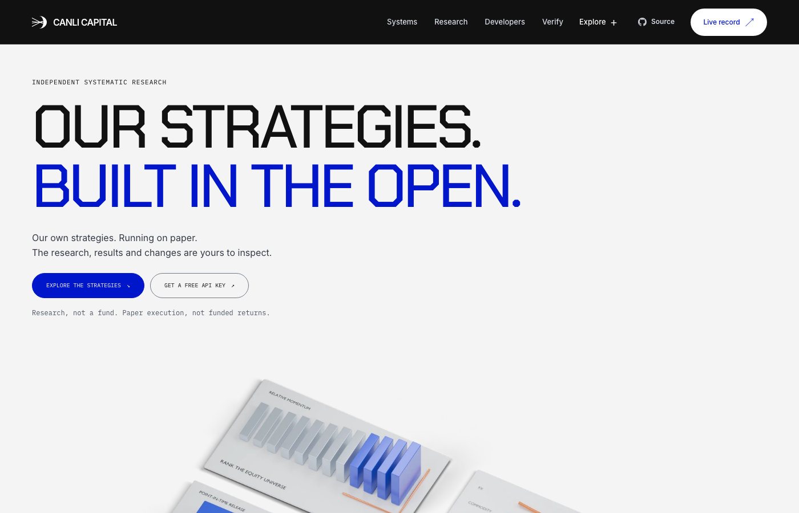
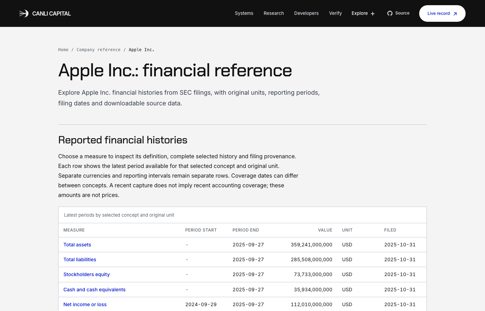

# Canli Capital

**Find out whether a backtest is real before you trust it.** Canli Capital publishes open quant
research where every number comes with the file that produced it, including the strategies that
failed. Free MCP servers and an API run the same checks on your own results.

[](https://www.npmjs.com/package/canli-validation-mcp)
[](https://www.npmjs.com/package/canli-validation-mcp)
[](https://github.com/arhancanli/canlicapital/actions/workflows/ci.yml)
[](https://scorecard.dev/viewer/?uri=github.com/arhancanli/canlicapital)
[](https://glama.ai/mcp/servers/arhancanli/canli-validation-mcp)
[](LICENSE)
[](LICENSE-DATA.md)

## Quick start

Add the backtest validator to Claude Code. In this mode it computes on your machine: no key, and
your numbers are not sent anywhere.

```bash
claude mcp add canli-local --env CANLI_LOCAL=1 -- npx -y canli-validation-mcp
```

Then ask: *"I tried 229 variants and kept the best: an annualised Sharpe of 1.5 over 730 daily
returns (365 a year), skew -0.5, kurtosis 5, and the variants' Sharpe ratios spread by 0.57. Is it
real?"* The assistant calls `validate_deflated_sharpe`: the best of 229 skill-less variants would
reach 1.60 by luck alone, so the probability that the Sharpe is above zero falls from 98.1% to
44.4% once the search is counted.

| MCP server | What it answers | Run it |
|---|---|---|
| [canli-validation-mcp](mcp/README.md) | Is this backtest real? Deflated Sharpe, overfitting (CSCV), data-snooping tests, track record length and a backtest lab, in 20 tools. | `npx -y canli-validation-mcp` |
| [canli-fundamentals-mcp](mcp-fundamentals/README.md) | What did a company first report, and what was known on a given date? SEC fundamentals point in time, each value with its filing. | `npx -y canli-fundamentals-mcp` |
| [canli-research-mcp](mcp-research/README.md) | Has this idea been tried here, and how did it end? Papers, killed candidates and trial counts. | `npx -y canli-research-mcp` |

Each server is also hosted, with nothing to install, for clients that take a URL:
`https://canlicapital.com/mcp`, `/mcp/fundamentals` and `/mcp/research`. Other clients are covered
in each server's README, and the plain HTTP API is under [More ways in](#more-ways-in).

## What makes it different

- **Every number comes with its limits.** Each result carries the sentences that say what it does
  not establish. Results from the API also carry an Ed25519-signed receipt that anyone can verify
  offline.
- **The tests were measured before they were trusted.** Given every variant you tried,
  `audit_backtest` leads with White's Reality Check, the test a pre-registered simulation study
  picked before seeing your numbers. In that study's confirmation run
  ([Null Zoo v1b](config/research/null-zoo-v1b-evaluation.json)) its false-positive rate was 4.5%
  to 6.4% at a nominal 5% across nine return shapes, and each result quotes the rate measured for
  returns shaped like yours.
- **Failures are published.** The [kill log](https://canlicapital.com/open) shows the ideas that
  died, with their real numbers, and the research server can search them.
- **Your series can stay with you.** Local mode computes the validators on your machine, with no
  key, and the series you check is never sent.

If it saves you from a fake backtest, a star helps other quants find it.



## More ways in

Call the free API: get a key (no signup), then deflate a Sharpe ratio for the number of trials you
ran.

```bash
curl -X POST https://canlicapital.com/api/v1/keys -H "Content-Type: application/json" -d '{"label":"readme"}'
export CANLI_KEY=ck_live_...   # the "key" field of that response; it is shown only once
curl -X POST https://canlicapital.com/api/v1/validate/deflated-sharpe \
  -H "Authorization: Bearer $CANLI_KEY" \
  -H "Content-Type: application/json" \
  -d '{"observed_sharpe_annualized":1.5,"observations":730,"periods_per_year":365,"skew":-0.5,"non_excess_kurtosis":5,"effective_independent_trials":229,"cross_trial_sharpe_sd_annualized":0.57}'
```

Or check the published record yourself (Python 3):

```bash
pip install cryptography
curl -sO https://canlicapital.com/glassbox/reproduce.py
for f in capacity_commitment founder_commitment; do curl -sO https://canlicapital.com/glassbox/$f.json; done
python3 reproduce.py --dir .
```

## What is here

- **Backtest validators** (deflated Sharpe, CSCV overfitting probability, minimum track record,
  haircut Sharpe, luck-equivalent trials) as an [MCP server](mcp/README.md) and a
  [free API](https://canlicapital.com/developers), each result with a signed receipt anyone can
  recompute.
- **SEC fundamentals point in time** as an [MCP server](mcp-fundamentals/README.md)
  (`npx -y canli-fundamentals-mcp`): what a company first reported, what was known on any date, and
  every later restatement, each value with its filing, computed locally from a hash-checked SEC
  snapshot.
- **The research record** as an [MCP server](mcp-research/README.md) (`npx -y canli-research-mcp`):
  papers, killed candidates, trial counts and the live paper record.
- **Company reference pages** built from SEC XBRL filings: financial histories where every value
  links to the filing it came from, with the year-on-year change and growth rate worked out.

  
- **Research**, including what failed: the [kill log](https://canlicapital.com/open), the
  [Null Zoo](https://canlicapital.com/research/null-zoo-v0) (overfitting corrections scored where
  the truth is known) and [luck-equivalent trials](https://canlicapital.com/research/luck-equivalent-trials).
- **Open data**: [FilingFacts](https://canlicapital.com/research/filing-facts-v0), financial
  questions with machine-checked answers from SEC filings (CC BY 4.0).
- **ALPHAC**, the three-strategy paper-trading book whose record is published daily; its engine is
  **[github.com/arhancanli/alphac](https://github.com/arhancanli/alphac)**.

## Contribute

- **Code and docs:** start with a
  [good first issue](https://github.com/arhancanli/canlicapital/issues?q=is%3Aissue+is%3Aopen+label%3A%22good+first+issue%22+-label%3A%22review+task%22).
  Each one names the files involved, what done looks like and how to test it.
- **Review tasks** (15 to 60 minutes, no code needed): recompute a published number or try to
  break the MCP server. [Open review tasks](https://github.com/arhancanli/canlicapital/issues?q=is%3Aissue+is%3Aopen+label%3A%22review+task%22)
  are credited on [/review](https://canlicapital.com/review).

After a merged contribution you can claim **Contributor access**: 10,000 validations per UTC day
on your API key instead of the standard 1,000, early access to new tools and servers on a beta
endpoint, priority on your issues and feature requests, and credit by name here, in the changelog
and release notes and, for research, in `CITATION.cff`. There are no cash rewards.
[CONTRIBUTING.md](CONTRIBUTING.md) explains how it works and how to claim it.

## Contributors

Maintained by [Arhan Canli](https://github.com/arhancanli). Everyone whose contribution is merged
is listed here by name, with what they did.

No outside contribution has been merged yet. Yours can be the first.

<!-- New contributors go below, oldest first: - [Name](https://github.com/handle): what they did (#PR) -->

**Created and maintained by [Arhan Canli](https://github.com/arhancanli) for Canli Capital.**
Machine-readable software citation metadata is provided in [`CITATION.cff`](CITATION.cff).

Current work and verified limitations: [persistent goal status](docs/goal/STATUS.md).

## Why this repo is public

The site's whole claim is *"a quant fund proving itself in public before it asks you to trust
it."* — the tagline in `config/brand.js`. A site that makes that claim and hides its own source
is asking for a trust it hasn't earned. So: this is the source, including the parts that enforce
honesty on us.

The load-bearing one is **`docs/retracted_claims.txt` in the engine repo**. When a number is
withdrawn it goes on a blocklist, and `check_retracted_claims.py` scans `dist/` and `public/` for
it before each deploy. It cannot be satisfied by deleting the number — a retracted figure must
still be quotable *inside its own retraction*, so a match counts only when the explanation is
absent from the surrounding window.

That check exists because the retraction here had already failed twice: a withdrawn DSR of 0.83
stayed on the homepage and in the social-unfurl card for six days after the signed chain formally
withdrew it. The pipeline was publishing the correction and the error in the same run.

The gate is now fail-closed for publication. Since 2026-08-19, both `live_tick.sh` and
`live_publish.sh` run `check_retracted_claims.py` after regeneration and skip the deploy when it
fails. Trading remains outside that blast radius: a publication defect can stop the website from
shipping, but cannot place, cancel, or delay an order.

## Publication surfaces

| surface | what it is |
|---|---|
| `index.html` | the landing: thesis, systems teaser, live record |
| `systems.html` | how the strategies work |
| `research.html` | the research programme, literature reviews, feasibility protocols |
| `performance.html` | the methodology and the honest numbers |
| `progress.html` | the build log |
| `open.html` | proven in the open: the kill log, the signed chain, glass-box artifacts |
| `verify.html` | independent verification instructions and downloadable evidence |
| `review.html` | the governed public criticism bench for five flagship papers |
| `foundry.html` | the fail-closed design and deployment-acceptance status for Foundry |
| `founder.html` | the ProfilePage that resolves every Arhan Canli authorship claim |
| `methodology.html` | evidence-linked answers to the research methodology questions |
| `research/*.html` | 114 generated technical reports, each with Scholar metadata and BibTeX |
| `research/topics/*.html` | 13 substantive subject and research-stage indexes |
| `measurements/*.html` | 89 generated Dataset pages with explicit claim boundaries |
| `engineering.html` | the open-source hub: the three repositories, what is hard in them, and a reading path |
| `notes/*.html` | engineering notes: post-mortems, derivations and design arguments |
| `tools/selection-risk.html` | the Selection Risk Lab: search a series with no edge, watch the deflation kill what you find |
| `tools/breadth.html` | the Breadth Lab: what a book of N sleeves is worth, and the ceiling no amount of breadth can pass |
| `tools/execution.html` | the Execution Reality Lab: which execution assumptions are costs, and which only look like costs |
| `tools/backtest-overfitting.html` | probability of backtest overfitting by Combinatorially Symmetric Cross-Validation, run in the browser on your own matrix |
| `tools.html` | the index of every browser calculator this project publishes |
| `developers.html` | the public read API: endpoints, the response envelope, and what each response cannot be used to claim |
| `mcp-servers/execution.html` | the private, Unreleased local paper execution workflow: sizing, order checks, signed journals and source-bound verification |
| `costs.html` | every cost that can reach a return, whether the engine charges it, and which way the answer is wrong when it does not |
| `standards/paper-evidence.html` | canli.paper-evidence.v0, a proposed open standard whose required fields are the ones a performance claim usually omits |

`public/paper-state.json` and `public/glassbox/*` are written by the engine's publish job, not by
hand. They are the machine-readable form of every claim the pages make. Current corpus counts are
derived during the build from `public/research-index.json`,
`public/glassbox/trial_packet_manifest.json`, and the generated measurement directory; the sitemap
is generated from the same files rather than maintained separately. The present build contains
341 canonical URLs in the sitemap (all indexable), plus a public noindex evidence page for every incomplete registered
trial and one archival HTML paper per registered sleeve. It publishes
identity-level packets for all 228 recorded hypotheses, while
honestly marking 226 of those packets incomplete.

The [local paper-journal example](mcp-execution/EXAMPLES.md) connects supplied sizing,
order checks and signed local journal evidence. The execution package remains private
and Unreleased, with journal writes explicitly enabled by the caller. It has no broker
connection and places no orders.

## Build and run

```sh
npm install
npm run build      # Vite multi-page build -> dist/
npm run preview    # serve the built dist
npm run dev        # dev server with hot reload
```

Three.js, GSAP + ScrollTrigger and Lenis are self-hosted — they install from npm and Vite
fingerprints them into `dist`. **Nothing is fetched from a CDN at runtime.** The build must stay
green, and source plus `dist` must contain zero em dashes (U+2014); both are audited before deploy.

## Brand and facts are single-sourced

`config/brand.js` is the one place names and numbers live. `js/shell.js` renders the nav and footer
from it so every page ships byte-identical chrome, and `js/main.js` binds `data-brand`,
`data-flagship`, `data-tagline` and `data-fact` nodes from it.

**`STATS` and `FACTS` are the only numeric claims permitted on the hand-authored marketing
surfaces.** Generated papers and measurement pages obtain their figures from engine exports and
carry their own source paths and claim boundaries. `audit-published-numbers.mjs` reconciles the
shared site-level figures; do not add a number to either layer without binding it to an
authoritative artifact.

## Not investment advice

Nothing on this site or in this repo is investment advice, an offer, or a solicitation. The record
published here is **paper trading**; the published ALPHAC strategy record includes no funded performance. Simulated and past
performance do not indicate future results. See `LICENSE`: provided "as is", without warranty.

## Glass-box platform expansion

The [platform direction and quality contract](docs/GLASSBOX-PLATFORM-VISION-2026-09-19.md)
connect the research engine, developer API/MCP and the company-reference collection. The local
expansion candidate adds 49 SEC-backed reference pages; it is not a million-page deployment.
The search goal is **at least 800,000 indexed pages, targeting 1,000,000**, recorded in
`config/search-growth-goal.json`. `npm run seo:inventory` reports built counts separately from
actual indexing evidence; the indexed count remains unverified until Search Console evidence
is available. `--require-indexed-minimum` fails while that evidence is missing.
`npm run seo:capacity` tests sitemap transport with synthetic URLs in a temporary directory.

Refresh selected company records explicitly with `npm run companies:import -- CIK [CIK ...]`.
Builds use captured public JSON and original compressed source snapshots, with no network ingestion
during publication. The selected latest-filed histories may contain restatements and are not
point-in-time backtest data. Public JSON downloads do not extend the validation API's capabilities.
